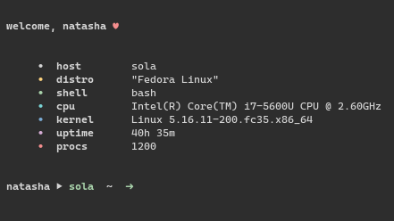

# qfetch // a C++ script
  
  
  
A quick fetch program for the terminal, written for Linux using C++.  
This is mostly a learning project, but I also really like it, and use it on my own desktop and servers.
